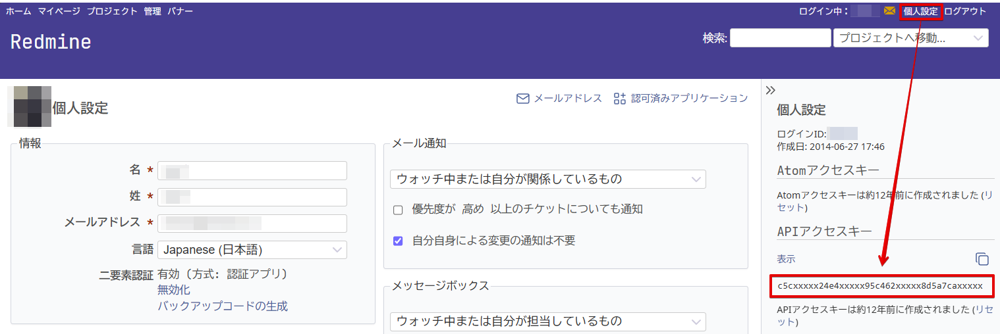
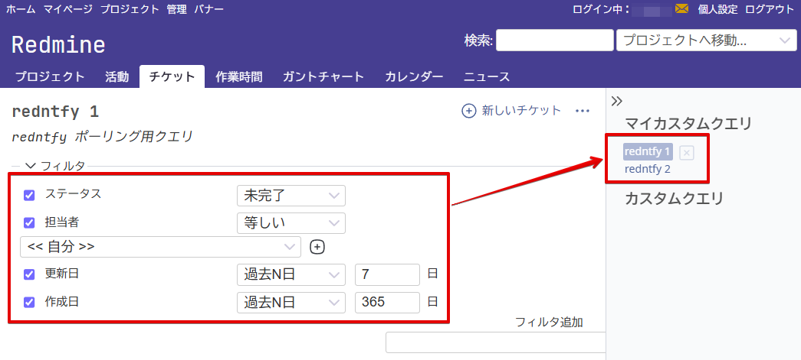
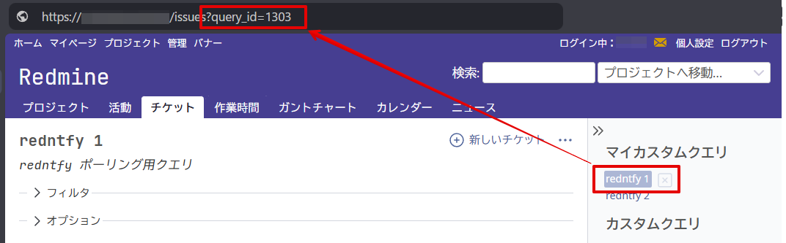

# redntfy セットアップガイド

redntfy を使い始めるための Redmine 側の準備から起動確認までを、画像付きで案内します。
このページの手順を上から順に進めると、チケットの更新通知が届く状態になります。

- [1. API アクセスキーの取得](#1-api-アクセスキーの取得)
- [2. 設定ファイルへの記載](#2-設定ファイルへの記載)
- [3. 起動と確認](#3-起動と確認)
- [4. カスタムクエリで追跡範囲を調整する（任意）](#4-カスタムクエリで追跡範囲を調整する任意)
- [うまくいかないとき](#うまくいかないとき)

## 1. API アクセスキーの取得

redntfy が Redmine へアクセスするための鍵となる文字列を取得します。

画面右上の「個人設定」を開き、右サイドバーの「API アクセスキー」で「表示」をクリックするとキーが現れます。
隣のアイコンをクリックするとクリップボードにコピーできます。



画像に写っているキーの値は例示用のダミーです。
取得したキーは他人に知られないよう扱ってください。

「API アクセスキー」の欄そのものが見当たらない場合、Redmine の REST API が無効になっています。
管理者に「管理」→「設定」→「API」で「RESTful な Web サービスを有効にする」を有効化してもらってください。

## 2. 設定ファイルへの記載

`redntfy.exe` と同じフォルダに `redntfy.local.toml` を作成し、取得した情報を記載します。

```toml
[redmine]
url     = "https://redmine.example.com"
api_key = "c5cxxxxx24e4xxxxx95c462xxxxx8d5a7caxxxxx"
```

- `url`：お使いの Redmine の URL
- `api_key`：手順 1 で取得した API アクセスキー（上記の値は例示用のダミー）

この 2 つだけで、自分（と所属グループ）が担当のオープンチケットが追跡対象になります。
追跡範囲を自分で調整したい場合は、手順 4 でカスタムクエリを設定します。

## 3. 起動と確認

`redntfy.exe` を起動（設定ファイルの編集前から起動していたなら再起動）します。
タスクトレイのアイコンにカーソルを乗せて（または左クリックして）、チケット一覧が表示されれば設定は完了です。
以降は追跡対象のチケットが新着・更新されるたびに通知が届きます。

## 4. カスタムクエリで追跡範囲を調整する（任意）

追跡するチケットの範囲は、Redmine のカスタムクエリで自由に決められます。
担当チケットの追跡だけで足りている間は、この手順は不要です。
カスタムクエリ機能そのものの説明は [5分でわかるRedmineの「カスタムクエリ」機能](https://redmine.jp/gofun/custom-queries/) を参照してください。
ここでは redntfy から参照できるクエリを作るための要点だけを説明します。

最も重要な点はひとつです。
**プロジェクトを選んでいない状態で、上部メニューの「チケット」から作成してください。**
特定プロジェクトの画面で保存したクエリは API から参照できず、redntfy が使えません。

フィルタを設定し、「カスタムクエリを保存」で名前を付けて保存すると、右サイドバーの「マイカスタムクエリ」に現れます。
クエリの名前は自由に付けて構いません。（画像の「redntfy 1」「redntfy 2」は一例）



フィルタの設定例です。

| フィルタ | 条件 | 値 |
| --- | --- | --- |
| ステータス | 未完了 | |
| 担当者 | 等しい | << 自分 >> |
| 更新日 | 過去N日 | 7 |
| 作成日 | 過去N日 | 365 |

期間で絞る 2 条件は必須ではありませんが、追跡対象が際限なく増えるのを防げるためおすすめです。

保存できたら、サイドバーのクエリ名をクリックして開き、ブラウザのアドレスバーに表示される `?query_id=N` の数値を控えてください。



控えた番号を `redntfy.local.toml` の `[redmine]` に追記し、redntfy を再起動します。

```toml
query_ids = [1303]
```

複数のクエリを追跡する場合は `query_ids = [1303, 1304]` のように並べます。
先頭の番号のクエリが、通知やチケット一覧の末尾から Redmine を開くときの画面に使われます。

## うまくいかないとき

- 一覧に 1 件も表示されない  
  追跡対象のチケットが本当にあるか、Redmine の画面で確認してください。担当チケットの追跡なら「チケット」画面で担当者を自分に絞り、カスタムクエリ設定時は同じクエリを開いて確認できます。

- トレイアイコンが無効状態の表示になっている  
  設定に不備があります。アイコンにマウスを載せると原因が表示されるので、案内に従って設定を直し、redntfy を再起動してください。

- 通知が来ない  
  トレイアイコンの右クリックメニューで「今すぐ更新」を実行し、反応を確認してください。詳しい動作記録は同メニューの「ログファイルを開く」で確認できます。

解決しない場合は [GitHub リポジトリ](https://github.com/aviscaerulea/redntfy) の README も参照してください。
